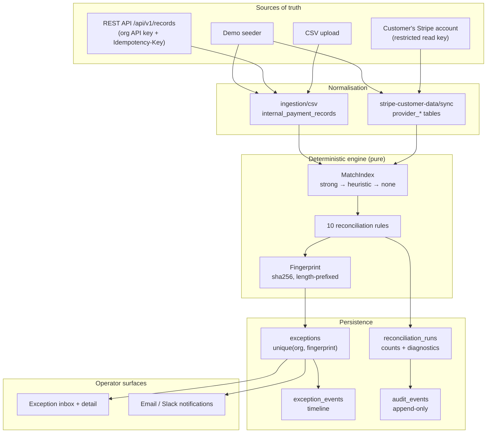
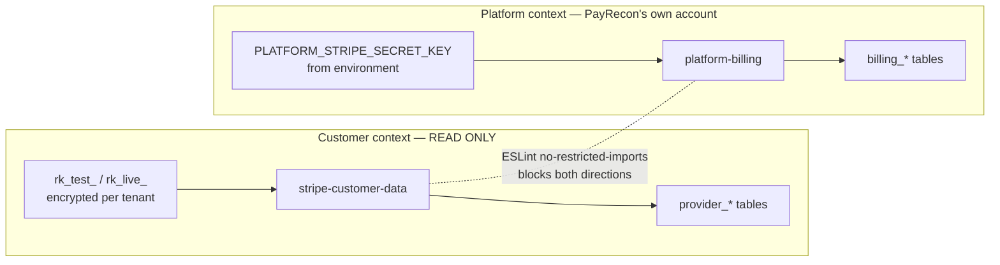
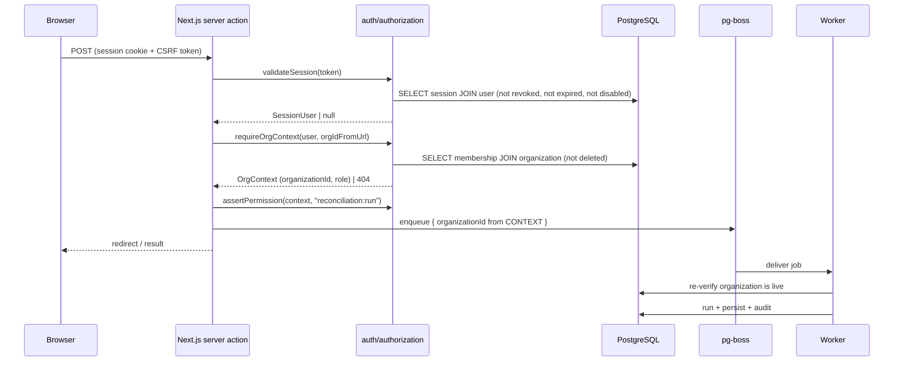

# Architecture

How PayRecon is put together, what flows through it, and why the boundaries are
where they are.

This document describes the implementation that exists. Where a component is
planned but not built, it says so.

---

## 1. Components

### Applications

| Component | Path          | Responsibility                                                                                                                                                                 |
| --------- | ------------- | ------------------------------------------------------------------------------------------------------------------------------------------------------------------------------ |
| Web       | `apps/web`    | Next.js App Router. Marketing page, auth pages, organization shell, dashboard, exception inbox. Server actions perform every mutation; the browser never queries the database. |
| Worker    | `apps/worker` | Long-lived Node process. Runs every retriable or scheduled unit of work and exposes `/health/live` and `/health/ready` on port 3001 (`WORKER_HEALTH_PORT`).                    |

Both processes create their own PostgreSQL pool (`packages/db/src/client.ts`)
and their own pg-boss instance. Neither shares a connection across tenants;
isolation is enforced by the repository layer, not by the connection.

### Packages

| Package                          | Depends on                           | Responsibility                                                                                                                                                                                                                                                    |
| -------------------------------- | ------------------------------------ | ----------------------------------------------------------------------------------------------------------------------------------------------------------------------------------------------------------------------------------------------------------------- |
| `@payrecon/config`               | zod                                  | Env schema and startup validation, plan/limit definitions, product metadata and cookie names.                                                                                                                                                                     |
| `@payrecon/domain`               | config, zod                          | **Pure.** Money, matching, the ten rules, fingerprints, permissions, exception state machine, redaction, boundary validation. No I/O, no database, no clock reads outside injected `now`.                                                                         |
| `@payrecon/db`                   | config, domain, drizzle, pg          | Schema, migrations, database guards, tenant-scoped repositories, and the services that orchestrate a reconciliation run, seed demo data, and delete an organization.                                                                                              |
| `@payrecon/auth`                 | config, db, domain                   | AES-256-GCM envelope, scrypt passwords, opaque tokens/API keys/CSRF, DB-backed sessions, tenant resolution and permission assertions.                                                                                                                             |
| `@payrecon/ingestion`            | auth, config, db, domain, csv-parse  | CSV parsing, header detection, column mapping, row validation, and the internal-record store.                                                                                                                                                                     |
| `@payrecon/jobs`                 | auth, config, db, domain, pg-boss    | Queue names, payload schemas, retry classes, enqueue helpers, schedules, handlers.                                                                                                                                                                                |
| `@payrecon/notifications`        | auth, config, db, domain, nodemailer | Destination management, message rendering and escaping, transports, delivery bookkeeping.                                                                                                                                                                         |
| `@payrecon/stripe-customer-data` | auth, config, db, domain, stripe     | The customer's **read-only** Stripe integration: key validation, credential encryption, transports (live and fake), retry, sync. `read-only-invariant.test.ts` reads the package's own source on every run and fails if a write-capable Stripe call ever appears. |
| `@payrecon/platform-billing`     | config, db, domain, stripe           | PayRecon's own subscription billing: client, checkout, signature-verified webhooks, plan mapping, entitlements. Verified with signed fixtures, not a live account.                                                                                                |

The dependency direction is strictly one-way: `domain` depends on nothing but
`config`, and everything else depends on `domain`. That is what makes the rules
testable without a database and re-runnable without side effects.

---

## 2. Data flow

### Step by step

1. **Ingestion.** Provider data arrives through the Stripe sync and lands in the
   `provider_*` tables, minimised to the fields matching and evidence need — no
   card data, no billing addresses, no raw payloads. Internal data arrives via
   CSV, the REST API, or the demo seeder and lands in
   `internal_payment_records`.
2. **Normalisation.** Both sides are converted into the provider-neutral shapes
   in `packages/domain/src/types.ts` (`ProviderPayment`, `InternalPaymentRecord`,
   …). The engine has exactly one shape to reason about and one set of fixtures.
3. **Matching.** `MatchIndex` (`packages/domain/src/matching.ts`) resolves the
   provider ↔ internal correspondence with explicit precedence: a strong match
   (explicit `providerTransactionId`, or a correlation id in provider metadata)
   beats a heuristic match (same customer, amount, currency, inside
   `heuristicMatchWindowHours`, and **mutually unique** on both sides). Anything
   ambiguous is counted, never guessed.
4. **Rules.** `runReconciliation` executes the ten rules in a fixed order over the
   matched data. Every rule is a pure function of its inputs plus an injected
   `now`, so two runs over identical inputs produce byte-identical fingerprints.
5. **Persistence.** `persistCandidates` takes a PostgreSQL advisory transaction
   lock keyed on the organization, then upserts against
   `unique(organization_id, fingerprint)`: a new fingerprint creates an
   exception, a fingerprint whose exception is `resolved` reopens it, and an
   already-active exception is left alone so an operator's acknowledgement is not
   reset. Counts, diagnostics and a source-freshness snapshot are written to the
   run.
6. **Notification.** Newly created and reopened exceptions become
   `notifiableExceptionIds`, which feed the notification dispatch job. Policies
   filter by severity, revenue threshold and currency; deliveries deduplicate on
   `unique(organization_id, dedupe_key)`.
7. **Audit.** Every run start, completion and failure, and every operator action,
   writes an `audit_events` row through `recordAudit`, with metadata passed
   through `redactObject` first.

---

## 3. The two Stripe contexts

PayRecon touches Stripe for two entirely unrelated reasons. Conflating them is
the single most dangerous mistake this codebase could make, so they are
separated at every layer.

| Layer       | Customer data integration                                          | Platform billing                                                                          |
| ----------- | ------------------------------------------------------------------ | ----------------------------------------------------------------------------------------- |
| Purpose     | Read a customer's operational Stripe data                          | Sell PayRecon subscriptions                                                               |
| Credential  | Customer's restricted key, encrypted per tenant                    | PayRecon's own secret key from the environment                                            |
| Env vars    | `STRIPE_CUSTOMER_TRANSPORT`, `STRIPE_CUSTOMER_RATE_LIMIT_RPS`      | `PLATFORM_STRIPE_SECRET_KEY`, `PLATFORM_STRIPE_WEBHOOK_SECRET`, `PLATFORM_STRIPE_PRICE_*` |
| Package     | `@payrecon/stripe-customer-data`                                   | `@payrecon/platform-billing`                                                              |
| Tables      | `stripe_connections`, `stripe_credentials`, `sync_*`, `provider_*` | `billing_customers`, `billing_subscriptions`, `billing_webhook_events`                    |
| Direction   | Read only. No write call exists.                                   | Read and write, but only against PayRecon's own account                                   |
| Schema file | `packages/db/src/schema/sources.ts`                                | `packages/db/src/schema/billing.ts`                                                       |

**Why separated:** a customer's restricted key must never reach code that can
create a charge, and PayRecon's platform credential must never be used to read a
customer's operational data. Revenue recorded by platform billing is PayRecon's
revenue and must never be mixed into a customer's reconciled operational
revenue.

**How it is enforced:** `eslint.config.js` declares `no-restricted-imports` in
**both** directions, so `@payrecon/platform-billing` cannot import
`@payrecon/stripe-customer-data` and vice versa. Nothing in `billing.ts`
references `stripe_connections`. Two tests back this up:
`packages/platform-billing/src/context-separation.test.ts` and
`packages/stripe-customer-data/src/read-only-invariant.test.ts`, the latter
reading the package's own source from disk and failing if a write-capable Stripe
call or a cross-context import ever appears. See
[`adr/0007-stripe-context-separation.md`](adr/0007-stripe-context-separation.md).

---

## 4. Job queue

pg-boss on the **same** PostgreSQL instance as the domain data
(`packages/jobs/src/queue.ts`, schema `pgboss`). One database means one thing to
back up, one thing to monitor, and job state that can be reasoned about
alongside the rows a job produced. See
[`adr/0009-job-queue.md`](adr/0009-job-queue.md).

### Queues

| Queue                          | Payload                                  | Singleton key    | Retry class   | Implemented                           |
| ------------------------------ | ---------------------------------------- | ---------------- | ------------- | ------------------------------------- |
| `reconciliation.run`           | org, trigger, triggeredBy, correlationId | `organizationId` | `compute`     | yes                                   |
| `reconciliation.schedule-tick` | none                                     | —                | `maintenance` | yes                                   |
| `stripe.sync`                  | org, connectionId, isInitial             | `connectionId`   | `network`     | queue defined; handler not registered |
| `import.process`               | org, batchId                             | `batchId`        | `compute`     | queue defined; handler not registered |
| `notification.dispatch`        | org, exceptionIds (1–500)                | —                | `delivery`    | queue defined; handler not registered |
| `notification.send-pending`    | none                                     | —                | `delivery`    | scheduled; handler not registered     |
| `retention.cleanup`            | none                                     | —                | `maintenance` | yes                                   |
| `session.cleanup`              | none                                     | —                | `maintenance` | yes                                   |

`registerHandlers` currently registers four handlers: `reconciliation.run`,
`reconciliation.schedule-tick`, `retention.cleanup` and `session.cleanup`. The
other queues are created at startup and can be enqueued to, but nothing consumes
them yet.

### Design rules

- **Single-flight per tenant.** `singletonKey` collapses a burst of "run
  reconciliation" clicks, a post-import trigger and the hourly schedule into one
  queued run per organization. The advisory lock inside `persistCandidates` is
  the second half of that defence — the queue prevents pile-up, the lock prevents
  two workers racing.
- **Fan-out, not one cron per tenant.** `reconciliation.schedule-tick` fires on
  `RECONCILIATION_SCHEDULE_CRON` and enqueues one job per live organization. One
  slow tenant cannot delay everyone else, each run gets its own retry budget, and
  no cron registry has to be reconciled when organizations are created or
  deleted.
- **Retry classes** (`RETRY_POLICIES`): `network` (6 attempts, 30 s base,
  exponential) for anything that usually succeeds later; `compute` (3 attempts,
  60 s) for work that is expensive to repeat; `delivery` (5 attempts, 60 s);
  `maintenance` (1 attempt, 300 s) for work that will simply run again on its
  next schedule. pg-boss applies jitter, which prevents a fleet of workers
  retrying in lockstep after a shared outage.
- **Payloads are validated twice** — on enqueue and again on execution — because
  a payload that was valid when queued can be invalid after a deploy.
- **Handlers re-derive tenant context.** `assertLiveOrganization` confirms the
  organization still exists and is not soft-deleted before doing any work, so a
  job queued before a deletion cannot resurrect it.
- **Graceful shutdown.** `SIGTERM`/`SIGINT` stop accepting new jobs, let
  in-flight jobs finish, then close the pool.

---

## 5. Request path

The organization id used for every query comes from the resolved `OrgContext`,
never from the request. A cross-tenant id resolves to `null` and surfaces as
404 — see `docs/SECURITY.md` for why not-found beats forbidden.

---

## 6. Determinism and idempotency

Four mechanisms make repeated work safe:

| Mechanism                                  | Prevents                                                      |
| ------------------------------------------ | ------------------------------------------------------------- |
| `unique(organization_id, provider_id)`     | Duplicate rows from a re-run or overlapping Stripe sync       |
| `unique(organization_id, external_id)`     | Duplicate internal records from a CSV re-import or API retry  |
| `unique(organization_id, fingerprint)`     | Duplicate open exceptions across runs                         |
| `unique(organization_id, idempotency_key)` | Replayed API mutations producing a second effect              |
| `pg_advisory_xact_lock(org)`               | Two workers persisting candidates for one tenant concurrently |
| pg-boss `singletonKey`                     | A queue of redundant runs for the same tenant                 |

Checkpoints (`sync_checkpoints.lastSuccessfulAt`) only advance when a resource
completes cleanly, so a failure on page 7 can never discard the progress earned
by pages 1–6 of a previous successful run.

---

## 7. Observability

- **Structured logs.** The worker emits JSON lines with `component`, `action` and
  outcome. Job failures log a queue name, job id, error _category_ and a
  redacted 300-character message — never the error's full text, which can quote
  row values.
- **Correlation.** `correlationId` flows from the request or job into
  `audit_events.correlation_id` and `exception_events.correlation_id`, so an
  operator action can be traced end to end.
- **Run diagnostics.** `reconciliation_runs.diagnostics` records the counters for
  data that deliberately did _not_ become an exception:
  `ambiguousProviderMatches`, `ambiguousInternalMatches`,
  `withinPropagationGrace`, `invalidCurrencyRecords`.
- **Source freshness.** `reconciliation_runs.source_snapshot` records per-connection
  last-successful-sync and last-import at the moment the run started, so the UI
  can state exactly how current the inputs were.

### Not yet implemented

- No metrics backend or counter abstraction is wired up. Structured logs and the
  run counters are the only telemetry today.
- `pino` is in the version catalog but no shared logger module exists; the worker
  writes JSON via `console.warn` / `console.error`.
- No dead-letter UI; terminal job failures are inspected with SQL against the
  `pgboss` schema.
