# Data model

Source of truth: `packages/db/src/schema/*.ts`. Migrations are generated by
drizzle-kit into `packages/db/drizzle/` and must never be hand-edited.

**37 tables**, created by two migrations: `0000_parallel_captain_marvel.sql` (36
tables) and `0001_tidy_quasar.sql`, which adds `api_rate_limit_buckets`.

---

## Tenancy model

`organizations` is both the tenant boundary and the billable entity.

Every tenant-owned table carries `organization_id` **directly**, rather than
reaching ownership through a join. The redundancy is deliberate: an unscoped
query becomes obviously wrong in review, and every index can start with the
tenant key. The only tables without `organization_id` are the ones that are
genuinely not tenant-owned:

| Table         | Why it has no `organization_id`                             |
| ------------- | ----------------------------------------------------------- |
| `users`       | A user is a person, and may belong to several organizations |
| `sessions`    | Belongs to a user, not to an organization                   |
| `auth_tokens` | Password reset / email verification; belongs to a user      |

Two tables carry a **nullable** `organization_id`:

- `audit_events` — null only for events that genuinely precede organization
  context (for example a failed sign-in). Cascades on organization delete.
- `billing_webhook_events` — Stripe events are received before they are mapped to
  an organization, and some never map to one. `on delete set null`, so purging a
  tenant does not destroy PayRecon's own billing receipt.

---

## ER diagram — core entities

```mermaid
erDiagram
    ORGANIZATIONS ||--o{ ORGANIZATION_MEMBERS : has
    USERS ||--o{ ORGANIZATION_MEMBERS : "belongs to"
    USERS ||--o{ SESSIONS : owns
    ORGANIZATIONS ||--o{ INVITATIONS : issues

    ORGANIZATIONS ||--o{ STRIPE_CONNECTIONS : owns
    STRIPE_CONNECTIONS ||--o{ STRIPE_CREDENTIALS : "one active version"
    STRIPE_CONNECTIONS ||--o{ SYNC_RUNS : records
    STRIPE_CONNECTIONS ||--o{ SYNC_CHECKPOINTS : "one per resource"
    STRIPE_CONNECTIONS ||--o{ PROVIDER_PAYMENTS : syncs
    STRIPE_CONNECTIONS ||--o{ PROVIDER_INVOICES : syncs
    STRIPE_CONNECTIONS ||--o{ PROVIDER_SUBSCRIPTIONS : syncs
    STRIPE_CONNECTIONS ||--o{ PROVIDER_REFUNDS : syncs

    ORGANIZATIONS ||--o{ INTERNAL_PAYMENT_RECORDS : owns
    ORGANIZATIONS ||--o{ IMPORT_BATCHES : owns
    IMPORT_BATCHES ||--o{ IMPORT_ROW_ERRORS : reports

    ORGANIZATIONS ||--o{ RECONCILIATION_RUNS : runs
    RECONCILIATION_RUNS ||--o{ EXCEPTIONS : "creates or reopens"
    EXCEPTIONS ||--o{ EXCEPTION_EVENTS : "timeline"
    USERS ||--o{ EXCEPTIONS : "assigned to"

    ORGANIZATIONS ||--o{ NOTIFICATION_DESTINATIONS : configures
    NOTIFICATION_DESTINATIONS ||--o{ NOTIFICATION_POLICIES : filtered_by
    NOTIFICATION_DESTINATIONS ||--o{ NOTIFICATION_DELIVERIES : receives
    NOTIFICATION_DELIVERIES ||--o{ NOTIFICATION_DELIVERY_ITEMS : covers
    EXCEPTIONS ||--o{ NOTIFICATION_DELIVERY_ITEMS : "included in"

    ORGANIZATIONS ||--o{ AUDIT_EVENTS : "append-only history"
    ORGANIZATIONS ||--|| BILLING_CUSTOMERS : "PayRecon billing"
    ORGANIZATIONS ||--o{ BILLING_SUBSCRIPTIONS : subscribes
```

---

## Tables by area

### Authentication — `schema/auth.ts`

| Table         | `organization_id` | Purpose                                                                                                                                                                      |
| ------------- | ----------------- | ---------------------------------------------------------------------------------------------------------------------------------------------------------------------------- |
| `users`       | no                | Identity. Stores a scrypt `password_hash` and never a plaintext password. `disabled_at` deactivates an account.                                                              |
| `sessions`    | no                | Server-side sessions. Stores only `token_hash` (SHA-256), plus `expires_at` (absolute), `last_seen_at` (idle), `revoked_at`, an HMAC'd `ip_hash` and a truncated user agent. |
| `auth_tokens` | no                | Single-use password-reset and email-verification tokens; hash only, with `expires_at` and `consumed_at`.                                                                     |

Constraints worth knowing:

- `users_email_lower_uidx` on `lower(email)` — email uniqueness is
  case-insensitive, so `Ada@x.com` and `ada@x.com` cannot both register.
- `sessions_token_hash_uidx` — the hash is the lookup key; the plaintext token
  exists only in the cookie.

### Organizations — `schema/organizations.ts`

| Table                  | `organization_id` | Purpose                                                                                                    |
| ---------------------- | ----------------- | ---------------------------------------------------------------------------------------------------------- |
| `organizations`        | _is the tenant_   | Name, slug, `plan_key`, `retention_days`, non-sensitive `settings`, `is_demo`, `deleted_at` (soft delete). |
| `organization_members` | yes               | The membership and its role (`owner`/`admin`/`analyst`/`viewer`).                                          |
| `invitations`          | yes               | Pending invitations; stores `token_hash` only, with `expires_at`, `accepted_at`, `revoked_at`.             |

Constraints and why:

- `organizations_slug_uidx` — slugs appear in URLs and must be globally unique.
- `organizations_retention_bounds` — `retention_days between 7 and 365`, matching
  `RETENTION_MIN_DAYS`/`RETENTION_MAX_DAYS` in `@payrecon/config`. A tenant
  cannot configure a retention window that defeats the product's own guarantees.
- `organizations_slug_format` — a regex check, so a slug can never contain
  path-hostile characters.
- `organization_members_org_user_uidx` — a user holds exactly **one** role per
  organization; two conflicting rows can never exist.
- `invitations_org_email_pending_uidx` — a **partial** unique index on
  `(organization_id, lower(email))` where `accepted_at is null and revoked_at is
null`, so at most one outstanding invitation exists per email per org, while
  historical accepted/revoked rows are preserved.
- `invitations_token_hash_uidx` — the plaintext token exists only in the email.

A database trigger (`payrecon_require_owner`, `packages/db/src/guards.ts`)
enforces that an organization always retains at least one owner. It deliberately
skips the check when the parent organization row is already gone, so a legitimate
organization delete is not blocked by its own FK cascade.

### Customer Stripe integration — `schema/sources.ts`

This is the **read-only customer data context**. Nothing here references the
billing tables.

| Table                           | `organization_id` | Purpose                                                                                                                                                          |
| ------------------------------- | ----------------- | ---------------------------------------------------------------------------------------------------------------------------------------------------------------- |
| `stripe_connections`            | yes               | One connected Stripe account: `stripe_account_id`, `livemode`, `status`, last validation result, the `readable_resources` observed, `disabled_at`, `deleted_at`. |
| `stripe_credentials`            | yes               | Encrypted restricted keys, versioned. `ciphertext`, `nonce`, `auth_tag`, `key_id`, `encryption_version`, plus non-secret `key_kind` and `key_last_four`.         |
| `sync_runs`                     | yes               | One synchronisation attempt: status, `is_initial`, per-resource `stats`, `error_category`, sanitised `error_message`.                                            |
| `sync_checkpoints`              | yes               | Per-resource cursor: `cursor`, `synced_through`, `last_successful_at`, `last_attempted_at`.                                                                      |
| `provider_payments`             | yes               | Normalised payment intents and charges: amount, refunded amount, currency, status, customer, invoice, `disputed`, bounded metadata.                              |
| `provider_refunds`              | yes               | Refunds against a payment.                                                                                                                                       |
| `provider_invoices`             | yes               | Invoice status, amount due/paid, subscription link, `attempt_count`, `paid_at`.                                                                                  |
| `provider_subscriptions`        | yes               | Subscription status, period bounds, `canceled_at`.                                                                                                               |
| `provider_customers`            | yes               | Minimal identity (email, name) so evidence is recognisable.                                                                                                      |
| `provider_disputes`             | yes               | Dispute amount, status, reason.                                                                                                                                  |
| `provider_payouts`              | yes               | Payout amount, status, arrival date.                                                                                                                             |
| `provider_balance_transactions` | yes               | Amount, fee, net, source id.                                                                                                                                     |

Constraints and why:

- **`unique(organization_id, provider_id)` on every `provider_*` table** — this is
  the tenant-scoped natural key that makes **sync upserts idempotent**. Re-running
  a sync, or two overlapping syncs, conflict on this index and update in place
  rather than inserting duplicates. Including `organization_id` means two tenants
  can legitimately hold the same Stripe object id (a shared platform account, a
  test fixture) without colliding.
- `stripe_credentials_active_uidx` — a **partial** unique index on
  `connection_id where revoked_at is null`: exactly one active credential version
  per connection at a time, while revoked versions remain for audit.
- `stripe_connections_org_account_uidx` — partial unique on
  `(organization_id, stripe_account_id) where deleted_at is null and
stripe_account_id is not null`, so one Stripe account is connected once per
  organization but a deleted connection does not block reconnecting.
- `sync_checkpoints_connection_resource_uidx` — one checkpoint per
  `(connection, resource)`; two concurrent syncs cannot create rival cursors.
- `provider_payments_currency_upper` and siblings — `currency ~ '^[A-Z]{3}$'`, so
  a lowercase or malformed code cannot enter the database at all.
- `provider_payments_amount_nonneg`, `provider_payments_refund_nonneg` — amounts
  are `BIGINT` minor units and must not be negative.

**Data minimisation:** these tables deliberately store no card details, no
payment-method data, no billing addresses and no raw Stripe payloads — only the
fields matching and evidence require.

### Internal ingestion — `schema/ingestion.ts`

| Table                      | `organization_id` | Purpose                                                                                                                                                                              |
| -------------------------- | ----------------- | ------------------------------------------------------------------------------------------------------------------------------------------------------------------------------------ |
| `internal_payment_records` | yes               | The customer's own view of a payment, from CSV, API or the demo seeder.                                                                                                              |
| `import_batches`           | yes               | One CSV upload: sanitised `filename`, `byte_size`, `status`, chosen `mapping`, detected `headers`, row counts, and `raw_content` (retained only until the retention window elapses). |
| `import_row_errors`        | yes               | Row-level validation failures with a 1-based `row_number`, `column`, message and a short sanitised `value_excerpt`.                                                                  |
| `mapping_templates`        | yes               | Saved column mappings so a recurring export format is mapped once.                                                                                                                   |
| `api_keys`                 | yes               | Organization API keys: non-secret `prefix`, SHA-256 `key_hash`, `scopes`, `last_used_at`, `expires_at`, `revoked_at`.                                                                |
| `api_idempotency_records`  | yes               | Idempotency for mutating API requests: `idempotency_key`, `request_hash`, stored response, `expires_at`.                                                                             |
| `api_rate_limit_buckets`   | yes               | Fixed-window rate-limit counters for the ingestion API (added by migration `0001_tidy_quasar.sql`).                                                                                  |
| `usage_counters`           | yes               | Monthly counters backing plan-limit enforcement, keyed by `YYYY-MM` `period` and `metric`.                                                                                           |

Constraints and why:

- **`internal_records_org_external_uidx`** on `(organization_id, external_id)` —
  the natural key that makes **upserts idempotent**. A CSV re-import and an API
  retry both target this key, so replaying either updates the row rather than
  creating a second one. Scoping by organization means two tenants may both use
  `order-1`.
- **`api_idempotency_org_key_uidx`** on `(organization_id, idempotency_key)` —
  prevents **API replay** from producing a second effect, and scopes the key per
  tenant so one organization's key can never collide with, or read, another's.
  `request_hash` (SHA-256 over method + path + canonical body) detects the same
  key being reused with _different_ content, which must be rejected rather than
  silently answered with a stale result.
- `api_keys_hash_uidx` and `api_keys_prefix_uidx` — the hash is the secret
  material; the prefix is the indexed, non-secret lookup handle.
- `api_rate_limit_org_bucket_uidx` on `(organization_id, bucket_key)` — the
  tenant appears in **both** the indexed column and inside `bucket_key`, so one
  organization's traffic can never consume another's allowance even if a future
  caller builds a key by hand.
- `usage_counters_org_period_metric_uidx` plus a `period ~ '^[0-9]{4}-[0-9]{2}$'`
  check — month boundaries are unambiguous and always UTC.
- `internal_records_currency_upper` — same three-uppercase-letter guarantee as the
  provider side.

`internal_payment_records.import_batch_id` records which batch last wrote the row.
It is a plain `uuid` column, **not** a foreign key, so purging old import
bookkeeping cannot cascade into payment records.

### Reconciliation — `schema/reconciliation.ts`

| Table                 | `organization_id` | Purpose                                                                                                                                                                                                           |
| --------------------- | ----------------- | ----------------------------------------------------------------------------------------------------------------------------------------------------------------------------------------------------------------- |
| `reconciliation_runs` | yes               | One run: `status`, `trigger`, `rule_version`, `counts`, `diagnostics`, `source_snapshot`, sanitised error fields.                                                                                                 |
| `exceptions`          | yes               | The inbox. Rule, severity, state, summary, exact `revenue_at_risk_minor` + `currency`, provider/internal identifiers, `evidence`, `probable_causes`, `recommended_actions`, assignee, first/last seen, `version`. |
| `exception_events`    | yes               | Append-only per-exception timeline: creation, re-detection, assignment, state transitions, actor and optional note.                                                                                               |

Constraints and why:

- **`exceptions_org_fingerprint_uidx`** on `(organization_id, fingerprint)` — the
  **deduplication** key. It is what prevents a repeated run creating a duplicate
  open exception, while letting a resolved exception be reopened _in place_ so
  its history survives. See
  [`adr/0006-exception-fingerprints.md`](adr/0006-exception-fingerprints.md).
- `exceptions.version` — optimistic concurrency. A state transition supplies the
  version it read and the `UPDATE` fails if another operator moved first, which
  prevents a lost update.
- `exceptions_risk_requires_currency` — `revenue_at_risk_minor is null or currency
is not null`. An amount without a currency is meaningless and would invite an
  accidental cross-currency sum.
- `exceptions_currency_upper` — three uppercase letters when present.
- `exception_events_note_len` — operator notes are capped at 2000 characters,
  matching `MAX_TRANSITION_NOTE_LENGTH`.

### Notifications — `schema/notifications.ts`

| Table                         | `organization_id` | Purpose                                                                                                                                                                                                                    |
| ----------------------------- | ----------------- | -------------------------------------------------------------------------------------------------------------------------------------------------------------------------------------------------------------------------- |
| `notification_destinations`   | yes               | Where alerts go. Email addresses live in `target`; a Slack webhook URL is a **credential** and is stored encrypted (`secret_ciphertext`/`secret_nonce`/`secret_auth_tag`/`secret_key_id`) with a non-secret `secret_hint`. |
| `notification_policies`       | yes               | Which exceptions reach a destination: `min_severity`, `min_revenue_at_risk_minor`, optional `currency`, `digest` cadence, `critical_bypasses_digest`.                                                                      |
| `notification_deliveries`     | yes               | One delivery attempt group: `dedupe_key`, status, `attempts`, non-sensitive `summary`, `scheduled_for`, `last_error`.                                                                                                      |
| `notification_delivery_items` | yes               | Join recording exactly which exceptions a delivery covered.                                                                                                                                                                |

- `notification_deliveries_org_dedupe_uidx` on `(organization_id, dedupe_key)` —
  the same exception cannot notify the same destination twice for the same
  reason, even if two workers process overlapping batches.
- `notification_destinations_org_name_uidx` — destination names are unique per
  organization so an operator cannot create two identically-labelled targets.

### Platform billing — `schema/billing.ts`

PayRecon's **own** subscriptions. Nothing here references `stripe_connections`.

| Table                    | `organization_id` | Purpose                                                                                                                                             |
| ------------------------ | ----------------- | --------------------------------------------------------------------------------------------------------------------------------------------------- |
| `billing_customers`      | yes               | Maps an organization to a customer id in PayRecon's own Stripe account.                                                                             |
| `billing_subscriptions`  | yes               | Subscription status, server-derived `plan_key`, `stripe_price_id`, period end, trial/cancel timestamps, `last_event_at` for out-of-order tolerance. |
| `billing_webhook_events` | nullable          | Durable webhook receipts.                                                                                                                           |

- `billing_customers_org_uidx` — one billing customer per organization.
- `billing_webhook_events_stripe_uidx` on `stripe_event_id` — makes webhook
  processing **idempotent**: a redelivered event conflicts on insert and is
  recognised as already handled rather than applied twice.
- `plan_key` is resolved server-side from the price id and is never supplied by
  the browser.

`packages/platform-billing/src` reads and writes these tables through
`store-drizzle.ts`, driven by signature-verified webhooks
(`webhooks.ts`) and checkout (`checkout.ts`). No live Stripe account is used —
verification is via signed test fixtures.

### Audit — `schema/audit.ts`

| Table          | `organization_id` | Purpose                                                                                                                                      |
| -------------- | ----------------- | -------------------------------------------------------------------------------------------------------------------------------------------- |
| `audit_events` | nullable, cascade | Immutable security- and finance-relevant history: actor type/id, `action`, target type/id, `correlation_id`, redacted `metadata`, hashed IP. |

`actor_api_key_id` is deliberately **not** a foreign key: API keys are deletable,
and the audit row must outlive the key it references.

Append-only is enforced by the database, not by convention. `applyGuards`
installs `audit_events_no_update` and `audit_events_no_delete` triggers that
raise `restrict_violation`. This was verified directly against PostgreSQL — see
`docs/IMPLEMENTATION_STATUS.md`.

---

## Cascade behaviour

| Relationship                                                             | On delete  | Rationale                                                            |
| ------------------------------------------------------------------------ | ---------- | -------------------------------------------------------------------- |
| any tenant table → `organizations`                                       | `cascade`  | Purging a tenant removes everything belonging to it in one statement |
| `stripe_credentials` → `stripe_connections`                              | `cascade`  | A credential has no meaning without its connection                   |
| `sync_runs` / `sync_checkpoints` / `provider_*` → `stripe_connections`   | `cascade`  | Synced data belongs to the connection that produced it               |
| `import_row_errors` → `import_batches`                                   | `cascade`  | Row errors are meaningless without their batch                       |
| `exception_events` → `exceptions`                                        | `cascade`  | The timeline belongs to the exception                                |
| `notification_delivery_items` → `notification_deliveries` / `exceptions` | `cascade`  | Join rows have no independent meaning                                |
| `sessions` / `auth_tokens` → `users`                                     | `cascade`  | Deleting a user must not leave usable credentials behind             |
| anything → `users` (creator, assignee, actor)                            | `set null` | Removing a user must never delete an organization's data             |
| `billing_webhook_events` → `organizations`                               | `set null` | PayRecon's own receipt survives a tenant purge                       |
| `api_idempotency_records` → `api_keys`                                   | `set null` | Revoking a key must not erase replay protection                      |
| `api_rate_limit_buckets` → `api_keys`                                    | `cascade`  | A revoked key's window counters are worthless                        |

Because every tenant-owned table declares
`organization_id ... onDelete: "cascade"`, PostgreSQL removes children before the
parent in a single statement. **No manual ordering is required** for a purge.

---

## Data-retention deletion order

Deletion happens at three different scopes, in increasing severity.

### 1. Scheduled retention cleanup (`retention.cleanup`, daily at 03:00)

Implemented in `packages/jobs/src/handlers.ts`. For each live organization, with
`cutoff = now - retention_days`:

1. `import_batches.raw_content` is set to `NULL` for batches created before the
   cutoff. **Only the raw uploaded file content is removed.**
2. An `audit_events` row (`retention.cleanup_ran`) records how many batches were
   cleared and the retention window used.

What retention cleanup deliberately does **not** touch: the batch row itself, its
row-level errors, the normalised `internal_payment_records`, provider data,
exceptions, or audit rows. An operator must still be able to see that an import
happened and what failed, and the aggregate/audit information is required to
survive.

**Not yet implemented:** expiry of `api_idempotency_records` past `expires_at`,
pruning of elapsed `api_rate_limit_buckets` windows, and provider-data retention.
`session.cleanup` (daily at 03:30) separately deletes sessions expired or revoked
more than 30 days ago.

### 2. Soft delete (`softDeleteOrganization`) — the ordinary product path

Sets `organizations.deleted_at`. Access ends immediately because
`resolveOrgContext` and `listUserOrganizations` both filter deleted rows, and
`assertLiveOrganization` stops queued jobs from doing further work. **Nothing is
destroyed**, so an accidental deletion is recoverable via `restoreOrganization`
and the audit trail survives.

### 3. Purge (`purgeOrganization`) — the privileged maintenance path

Physically removes the tenant. Because `audit_events` is append-only, the FK
cascade would be rejected by the trigger, so the purge explicitly disables
`audit_events_no_delete` **inside one transaction**, deletes the organization,
and re-enables it in a `finally`. PostgreSQL DDL is transactional, so a failed
delete restores the trigger automatically.

Effective order once the cascade fires:

1. All `provider_*`, `sync_*`, `stripe_credentials`, `stripe_connections`
2. `internal_payment_records`, `import_row_errors`, `import_batches`,
   `mapping_templates`, `api_*`, `usage_counters`
3. `notification_delivery_items`, `notification_deliveries`,
   `notification_policies`, `notification_destinations`
4. `exception_events`, `exceptions`, `reconciliation_runs`
5. `billing_customers`, `billing_subscriptions`
   (`billing_webhook_events.organization_id` → `NULL`)
6. `audit_events`
7. `invitations`, `organization_members`
8. `organizations`

Users are never deleted — they may belong to other organizations. The runbook,
including when a purge is appropriate, is in
[`OPERATIONS.md`](OPERATIONS.md).

---

## Enumerations

Domain unions in `@payrecon/domain` are mirrored as PostgreSQL enums in
`schema/enums.ts`, so an invalid value cannot be written by a migration, a manual
query, or a code path that skips validation.

`organization_role`, `plan_key`, `connection_status`, `sync_status`,
`sync_resource`, `internal_payment_status`, `record_source`,
`provider_payment_status`, `provider_refund_status`, `provider_invoice_status`,
`provider_subscription_status`, `import_status`, `exception_severity`,
`exception_state`, `reconciliation_run_status`, `run_trigger`, `actor_type`,
`notification_kind`, `notification_destination_status`, `notification_digest`,
`notification_delivery_status`, `billing_subscription_status`,
`webhook_processing_status`.

---

## Money and time columns

- Money is always `BIGINT` minor units (`bigint(..., { mode: "bigint" })`) paired
  with a three-uppercase-letter `currency` column guarded by a check constraint.
  Never a float, never a numeric, never a currency-less amount. See
  [`adr/0004-money-representation.md`](adr/0004-money-representation.md).
- Timestamps are `timestamp with time zone` in `mode: "date"` everywhere, stored
  in UTC and rendered in the user's locale.
- drizzle-kit cannot serialise a `bigint` column default, so defaults are written
  as SQL literals (`.default(sql`0`)`).
