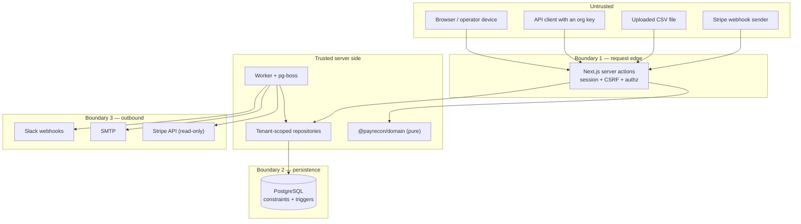

# Threat model

What PayRecon is protecting, who it is protecting it from, and — honestly — what
it does not yet defend against.

Companion documents: [`SECURITY.md`](SECURITY.md) describes the mechanisms;
[`OPERATIONS.md`](OPERATIONS.md) describes the response procedures.

---

## 1. Assets

Ranked by what an attacker gains from them.

| #   | Asset                               | Where it lives                                                                          | Impact if compromised                                                                     |
| --- | ----------------------------------- | --------------------------------------------------------------------------------------- | ----------------------------------------------------------------------------------------- |
| 1   | **Customer Stripe restricted keys** | `stripe_credentials` (AES-256-GCM), plaintext only in the worker's memory during a sync | Read access to a customer's entire Stripe account: payments, customers, invoices, payouts |
| 2   | **Master encryption key**           | `ENCRYPTION_KEY` in the environment / secret manager                                    | Decrypts every stored credential for every tenant                                         |
| 3   | **`AUTH_SECRET`**                   | Environment                                                                             | Forge CSRF tokens; reverse IP hashes                                                      |
| 4   | **Session tokens**                  | Browser cookie; SHA-256 hash in `sessions`                                              | Full impersonation of a user, at their role                                               |
| 5   | **Slack webhook URLs**              | `notification_destinations.secret_*` (AES-256-GCM)                                      | Post arbitrary messages into a customer's Slack workspace                                 |
| 6   | **Organization API keys**           | Plaintext shown once; SHA-256 hash in `api_keys`                                        | Write internal payment records into a tenant                                              |
| 7   | **Tenant operational data**         | `provider_*`, `internal_payment_records`, `exceptions`                                  | Revenue figures, customer emails, payment volumes — commercially sensitive                |
| 8   | **Audit log**                       | `audit_events`                                                                          | An attacker who can edit it can erase evidence of everything above                        |
| 9   | **User credentials**                | `users.password_hash` (scrypt)                                                          | Account takeover, and credential-stuffing against other services                          |
| 10  | **PayRecon's own billing state**    | `billing_*`                                                                             | Free service; falsified entitlements                                                      |

---

## 2. Trust boundaries

**Boundary 1 — request edge.** Everything from a browser or an API client is
hostile until validated. Session, CSRF and authorization are all resolved here;
no organization id from the request survives past it.

**Boundary 2 — persistence.** The database enforces invariants that application
code could forget: uniqueness for idempotency, check constraints on currency and
amounts, the append-only audit trigger, the last-owner trigger.

**Boundary 3 — outbound.** Everything leaving the process passes through
redaction. The Stripe connection is read-only by construction.

**Explicitly out of scope.** A compromise of the host, of the PostgreSQL
superuser, of `ENCRYPTION_KEY` in the secret manager, or of Stripe itself is not
defended against by this application. Those are infrastructure controls.

---

## 3. Threats and mitigations

### T1 — Cross-tenant data access (IDOR)

_A user of organization A manipulates an id — a URL segment, a form field, an
object id in a payload — to read or modify organization B's data._

**Mitigations.** Every tenant-owned table carries `organization_id` directly.
Every request resolves the organization through `resolveOrgContext`, which
requires a membership row; queries then use the id from that **context**, never
from the request. Ids are shape-checked with `isUuid` before any query.
Background jobs re-verify tenant context against the database rather than
trusting the payload (`assertLiveOrganization`). Rate-limit buckets,
deduplication keys and idempotency keys all embed the tenant.

**Where implemented.** `packages/auth/src/authorization.ts`;
`packages/db/src/repositories/*`; `packages/jobs/src/handlers.ts`;
`packages/db/src/schema/*` (the `organization_id` column and its indexes).

**How tested.** `tests/integration/tenant-isolation.test.ts` attempts
cross-tenant reads and writes against a real PostgreSQL and asserts they fail.

**Residual risk.** A new repository function that forgets the tenant filter would
not be caught mechanically — there is no lint rule or row-level-security policy
enforcing it. RLS would be a genuine defence in depth and is not implemented.

---

### T2 — Credential theft at rest

_An attacker obtains a database dump — a leaked backup, a compromised replica, a
misconfigured snapshot — and wants the customers' Stripe keys._

**Mitigations.** Restricted keys and Slack webhook URLs are stored as AES-256-GCM
ciphertext with a per-encryption 96-bit nonce and a separate 128-bit auth tag.
The master key lives only in the environment, never in the database, so a dump
alone yields nothing. AAD binds each ciphertext to `organization_id`, `purpose`
and record, so ciphertext cannot be moved between tenants or between uses.
`key_id` supports rotation. Only `key_kind` and `key_last_four` are stored in
clear.

**Where implemented.** `packages/auth/src/crypto.ts`;
`packages/db/src/schema/sources.ts` and `schema/notifications.ts`.

**How tested.** `packages/stripe-customer-data/src/credentials.test.ts` and the
crypto tests cover round-trip, unique nonces, wrong-key failure, tampered
ciphertext and tampered AAD.

**Residual risk.** An attacker with **both** the database and `ENCRYPTION_KEY`
recovers everything. There is no HSM, no per-tenant key derivation, and no
envelope-encryption service. Plaintext exists transiently in worker memory during
a sync and would appear in a process core dump.

---

### T3 — Stolen or replayed session

_An attacker obtains a session cookie via XSS, a shared machine, or a stolen
device._

**Mitigations.** The cookie carries an opaque 256-bit random token; the database
stores only its SHA-256 hash, so a database leak does not yield sessions.
Absolute expiry is enforced in SQL on every lookup; idle expiry **revokes** the
row rather than merely rejecting it. The lookup joins `users` and requires
`disabled_at is null`, so disabling an account terminates every session
immediately. `revokeAllUserSessions` backs password change and "sign out
everywhere". Because sessions are database-backed, revocation is immediate rather
than waiting for a token to expire.

**Where implemented.** `packages/auth/src/session.ts`;
`packages/db/src/schema/auth.ts`.

**How tested.** `tests/integration/lifecycle-and-guards.test.ts` covers session
lifecycle behaviour against a real database.

**Residual risk.** No device binding, no re-authentication step before sensitive
actions, and no "active sessions" management UI. Cookie attributes
(`httpOnly`, `Secure`, `SameSite`) are the caller's responsibility in
`apps/web/src/server/session.ts` and are not asserted by a test. A CSP **is**
configured (`apps/web/next.config.ts`), but `script-src` allows
`'unsafe-inline'`, so its XSS protection is materially weaker than a nonce-based
policy would be.

---

### T4 — Cross-site request forgery

_A hostile page causes an authenticated browser to submit a state-changing
request._

**Mitigations.** Double-submit token that is an HMAC-SHA256 over the session id
keyed by `AUTH_SECRET`, so a token minted in the attacker's own session is
invalid in the victim's, and an attacker who cannot read the session cookie
cannot compute a valid token. Comparison is constant-time. `APP_URL` must be
`https` in production, which the env validator enforces because secure cookies
depend on it.

**Where implemented.** `packages/auth/src/tokens.ts`;
`apps/web/src/server/csrf.ts`.

**How tested.** Token derivation and verification are unit-tested. There is **no**
end-to-end test that a server action rejects a request with a missing or foreign
CSRF token.

**Residual risk.** The gap above. `SameSite` cookie configuration is not asserted
anywhere.

---

### T5 — Privilege escalation via role change

_An admin promotes themselves to owner; a member removes the last owner and
orphans the organization; someone grants a role more senior than their own._

**Mitigations.** `canAssignRole` refuses to grant a role more senior than the
actor's and permits creating an owner **only** if the actor is an owner.
`canManageMemberWithRole` prevents an admin removing an owner.
`wouldRemoveLastOwner` blocks demoting or removing the final owner. A database
trigger, `payrecon_require_owner`, is the backstop for any code path that
forgets — and deliberately skips itself when the parent organization is already
being deleted, so a legitimate delete is not blocked by its own cascade.
`unique(organization_id, user_id)` on `organization_members` means a user cannot
hold two conflicting roles.

**Where implemented.** `packages/domain/src/permissions.ts`;
`packages/db/src/guards.ts`; `apps/web/src/server/member-actions.ts`.

**How tested.** `packages/domain/src/permissions.test.ts` asserts every
role/permission pair, so widening access fails the build.
`tests/integration/lifecycle-and-guards.test.ts` exercises the last-owner trigger
against PostgreSQL.

**Residual risk.** There is no separate ownership-transfer flow with confirmation
— `org:transfer_ownership` exists as a permission but the guarded UI flow is not
built. No approval or notification is sent when a role changes.

---

### T6 — Webhook forgery and replay

_An attacker posts a fabricated `customer.subscription.updated` to grant
themselves a paid plan, or replays a genuine event to double-apply it._

**Mitigations.** Signatures are verified against the **raw request body** with
`PLATFORM_STRIPE_WEBHOOK_SECRET` before an event is trusted; a bad signature is a
permanent 400 rather than a retryable error, because retrying a forged event is
pointless. `billing_webhook_events.stripe_event_id` is unique, so a redelivered
event conflicts on insert and is recognised as already handled rather than
applied twice. `event_created_at` and `billing_subscriptions.last_event_at` make
processing order-tolerant, so a late-arriving stale event cannot overwrite newer
state. `plan_key` is resolved **server-side** from the price id and never
accepted from a payload. The env validator refuses
`PLATFORM_STRIPE_SECRET_KEY` without `PLATFORM_STRIPE_WEBHOOK_SECRET`, so a
deployment cannot start with signature verification effectively disabled.

**Where implemented.** `packages/platform-billing/src/webhooks.ts`;
`packages/platform-billing/src/plan-mapping.ts`;
`packages/db/src/schema/billing.ts`; `packages/config/src/env.ts`.

**How tested.** `packages/platform-billing/src/webhooks.test.ts` covers signature
verification and replay behaviour with signed fixtures; `plan-mapping.test.ts`
covers server-side plan resolution. The verification function is injectable, so
tests exercise the real code path rather than a stub.

**Residual risk.** No live Stripe account is available in this environment, so
the path is verified with signed fixtures rather than against Stripe. Clock skew
and Stripe's timestamp tolerance are not independently tested.

---

### T7 — CSV formula injection

_A hostile value such as `=IMPORTXML(…)` or `@SUM(…)` is imported and later
exported, executing when the operator opens the file._

**Mitigations.** `sanitizeCsvValue` prefixes any cell beginning with `=`, `+`,
`-`, `@`, tab or carriage return with an apostrophe, forcing spreadsheet
applications to treat it as text. `toCsvCell` applies that before quoting.
`safeFilename` strips control characters by code point, replaces path separators,
removes leading dots and truncates, so a filename cannot traverse directories or
poison a `Content-Disposition` header.

**Where implemented.** `packages/domain/src/redaction.ts`.

**How tested.** `packages/domain/src/redaction.test.ts` covers each dangerous
leading character and the filename cases.

**Residual risk.** Protection lives in the writer helpers. No export route exists
yet, so nothing enforces that a future export uses them — a hand-rolled
`join(",")` would bypass it.

---

### T8 — Denial of service via oversized upload or body

_A request with a huge body, a 500 MB CSV, or a bulk upsert of a million records
exhausts memory or blocks a worker._

**Mitigations.** `MAX_API_BODY_BYTES` 1 MiB, `MAX_BULK_RECORDS` 1000,
`MAX_CSV_BYTES` 20 MiB, `MAX_CSV_ROWS` 100 000, CSV error cap 1000.
`notificationDispatchPayload` caps `exceptionIds` at 500. The database pool sets
`statement_timeout` to 60 s and `connectionTimeoutMillis` to 10 s, so a runaway
query cannot hold a connection and callers fail fast rather than queueing behind
an exhausted pool. Large accepted imports are processed in the worker, not in a
browser request. `pg-boss` `expireInSeconds` bounds job runtime (900 s for
reconciliation, 1800 s for sync and import). scrypt parameter bounds prevent a
hostile stored hash forcing an expensive derivation.

**Where implemented.** `packages/domain/src/validation.ts`;
`packages/db/src/client.ts`; `packages/jobs/src/queue.ts`;
`packages/auth/src/password.ts`.

The ingestion API is rate limited per organization and key —
`DEFAULT_RATE_LIMIT` 120 requests per 60-second window, counted in
`api_rate_limit_buckets` (`packages/ingestion/src/rate-limit.ts`). The bucket key
embeds the tenant, which also appears as an indexed column, so one organization
cannot consume another's allowance.

**Where implemented.** `packages/domain/src/validation.ts`;
`packages/ingestion/src/rate-limit.ts`; `apps/web/app/api/v1/_lib/authenticate.ts`;
`packages/db/src/client.ts`; `packages/jobs/src/queue.ts`;
`packages/auth/src/password.ts`.

**How tested.** Validation limits and `packages/ingestion/src/rate-limit.test.ts`
are unit-tested. There is no load test.

**Residual risk.** **Authentication attempts are not rate-limited**, so password
spraying against the deliberately expensive scrypt verification is a
CPU-exhaustion vector. Rate-limit windows are counted, not reserved, so a burst
of concurrent requests can slightly overshoot the limit. Elapsed buckets are not
pruned by any retention job.

---

### T9 — Secret leakage through logs and errors

_A credential reaches a log aggregator, an error page, an audit row, or a test
snapshot._

**Mitigations.** Env validation prints names, never values. `redactObject`
redacts by key pattern and by value pattern, with depth, string-length and array
bounds. Audit metadata passes through `redactObject` before it is written. Only a
`PublicError` reaches the browser with its own message; everything else becomes a
generic message — no stack traces, no driver text. `errorCategory` gives
dashboards a class without the content. Job failures log a redacted 300-character
summary. Sanitised error fields (`error_category`, `error_message`) are stored on
`sync_runs` and `reconciliation_runs`. `run-reconciliation.ts` explicitly passes
driver errors through `redactSecretsInText` because a driver message can quote
row values. `migrate.ts` prints the PostgreSQL code, detail and hint but never
the connection string, which contains a password.

**Where implemented.** `packages/domain/src/redaction.ts`;
`packages/config/src/env.ts`; `packages/db/src/migrate.ts`;
`packages/db/src/services/run-reconciliation.ts`; `packages/jobs/src/handlers.ts`.

**How tested.** `packages/domain/src/redaction.test.ts` covers key patterns, each
value pattern, depth and length bounds.

**Residual risk.** Redaction is opt-in at each call site. Nothing forces a future
`console.log` through it, and there is no central logger to enforce it — `pino`
is in the catalog but no shared logger module exists.

---

### T10 — Insider tampering with the audit log

_Someone with application-level database access rewrites or deletes audit rows to
hide what they did._

**Mitigations.** Append-only is enforced by **database triggers**
(`audit_events_no_update`, `audit_events_no_delete`), not by application
convention, so even a compromised code path holding the application's credentials
cannot rewrite history. The guards are re-applied idempotently by every migration
run, so they cannot be quietly dropped and left off. The single sanctioned
exception — `purgeOrganization` — disables the delete trigger for the duration of
one transaction and restores it in a `finally`; PostgreSQL's transactional DDL
restores it automatically if the delete fails. The required ACCESS EXCLUSIVE lock
makes this unmistakably a maintenance operation, not something an ordinary
request path can reach.

**Where implemented.** `packages/db/src/guards.ts`;
`packages/db/src/services/purge-organization.ts`;
`packages/db/src/migrate.ts`.

**How tested.** Verified directly against PostgreSQL — `UPDATE` and `DELETE` both
raise `audit_events is append-only`, and the row survives unchanged
(`docs/IMPLEMENTATION_STATUS.md`). Also covered by
`tests/integration/lifecycle-and-guards.test.ts`.

**Residual risk.** A database **superuser** can disable any trigger, so this
defends against a compromised application, not a compromised DBA. Audit rows are
not signed, hash-chained or shipped to an append-only external store, so tampering
by a superuser would be undetectable. `purgeOrganization` destroys the audit trail
it was protecting — the runbook therefore requires the reason to be recorded
durably **outside** the tenant first.

---

## 4. Residual risk summary

Ordered by what should be closed first.

| #   | Residual risk                                                | Severity | Note                                                            |
| --- | ------------------------------------------------------------ | -------- | --------------------------------------------------------------- |
| 1   | Authentication attempts are not rate-limited                 | High     | Scrypt is expensive by design, so spraying is also a CPU attack |
| 2   | `'unsafe-inline'` in the CSP's `script-src`                  | Medium   | Weakens the XSS pre-condition behind T3                         |
| 3   | No row-level security as defence in depth for tenant scoping | Medium   | Correctness depends on repository discipline                    |
| 4   | Audit log not tamper-evident against a database superuser    | Medium   | No signing, hash chain, or external append-only sink            |
| 5   | Master key compromise breaks all tenants at once             | Medium   | No per-tenant derivation, no HSM                                |
| 6   | No end-to-end CSRF rejection test                            | Medium   | Primitives are tested; the enforcement path is not              |
| 7   | Billing verified with fixtures, never against Stripe         | Medium   | No live account available in this environment                   |
| 8   | Rate-limit windows are counted, not reserved                 | Low      | A concurrent burst can overshoot slightly                       |
| 9   | Ownership-transfer flow not built                            | Low      | Permission exists; guarded UI does not                          |
| 10  | No metrics backend, so abuse is not observable in real time  | Low      | Structured logs and run counters only                           |
